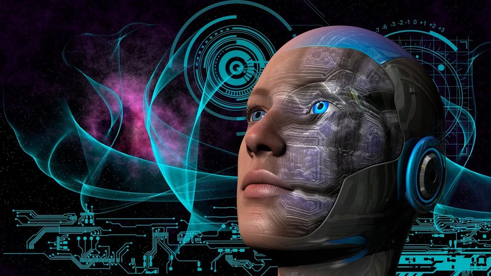

### The Computational Convergence at the Limits of Human Language: Implications and Paradigms

#### Abstract

The evolution of [artificial intelligence (AI)](/literary_products/joes_notes/ARTIFICIAL_INTELLIGENCE.md) and advancements in [quantum computation](/literary_products/joes_notes/QUANTUM_COMPUTATION.md) herald a future where machines operate at the theoretical limits of human language. These systems will predict and compute every feasible linguistic combination, enabling unparalleled foresight into human communication. This paper surveys the implications of such a paradigm shift, addressing [linguistic determinism](/literary_products/joes_notes/LINGUISTIC_DETERMINISM.md), [cognitive augmentation](/literary_products/joes_notes/COGNITIVE_AUGMENTATION.md), and societal transformation. Using empirical methodologies and theoretical constructs, we explore how this convergence may redefine [human-machine interactions](/literary_products/joes_notes/HUMAN_MACHINE_INTERACTIONS.md), cognitive processes, and the [socio-technical landscape](/literary_products/joes_notes/SOCIO_TECHNICAL_LANDSCAPE.md).

### 1. Introduction

Natural languages, including English, are inherently low-dimensional systems constrained by finite grammar, vocabulary, and cognitive limitations. Despite their generative capacities, languages are bounded by predictable combinatorial possibilities. AI systems, supported by [quantum computation](/literary_products/joes_notes/QUANTUM_COMPUTATION.md), will soon compute at the edges of these possibilities, operating faster than humans can innovate linguistically. This paper investigates the implications of such systems, focusing on:

1. The computational predictability of human language.
2. The theoretical and practical boundaries of linguistic expressivity.
3. The socio-technical consequences of machine-enabled linguistic foresight.

---

### 2. Background and Framework

#### 2.1 Linguistic Limits and Dimensionality

Languages are generative but finite systems, described by:
- **Chomsky’s Hierarchy**: Defines the generative capabilities of grammars.
- **Zipf’s Law**: Captures frequency distributions of linguistic tokens.
- **Information Theory**: Models redundancy and entropy in communication.

These frameworks reveal inherent constraints on what can be expressed, predicted, and understood within human language.

#### 2.2 Computational Systems at the Limits

- **Classical AI Systems**: Use statistical and neural models (e.g., GPT) to approximate language generation.
- **Quantum AI Systems**: Leverage superposition and entanglement to compute across vast linguistic spaces simultaneously.
- **Vectorized Representations**: Current AI models operate in high-dimensional spaces, representing linguistic relationships with unprecedented precision.

---

### 3. Implications of Linguistic Convergence

#### 3.1 Predictive Linguistic Capability

AI systems, operating at linguistic limits, will:
- Predict likely human utterances in any context with high precision.
- Preemptively generate responses to unprecedented queries, “closing” the generative potential of language.
- Simulate evolutionary trajectories of languages faster than natural progression.

#### 3.2 Socio-Cultural Impact

- **Privacy Erosion**: Machines’ predictive capabilities may compromise individual privacy by anticipating speech, thoughts, and intentions.
- **Language Homogenization**: AI’s preference for statistical optimization could accelerate the loss of linguistic diversity.
- **Narrative Domination**: Systems predicting and generating content faster than humans may control cultural narratives, shaping public discourse.

#### 3.3 Cognitive and Educational Shifts

- **Human Cognitive Constraints**: As machines outperform humans in linguistic creativity, there may be a diminishing role for human linguistic innovation.
- **Language Learning**: AI might replace traditional methods with tailored, predictive teaching models.
- **Augmented Cognition**: Machines could act as extensions of human thought, enhancing cognitive capabilities but risking dependency.

#### 3.4 Philosophical and Ethical Questions

- **Determinism vs. Creativity**: Does predictive computation undermine human creativity?
- **Linguistic Free Will**: If machines predict all possible expressions, do humans retain linguistic autonomy?
- **Alignment Problems**: Ensuring that AI-driven linguistic systems align with human values and intentions.

---

### 4. Enabling Technologies

#### 4.1 Quantum Computing

Quantum systems will enable:
- Exponential scaling in computational linguistics.
- Real-time processing of complex, multi-dimensional language models.
- Enhanced simulation of linguistic evolution and emergent phenomena.

#### 4.2 Advanced AI Architectures

- **Transformer Models**: E.g., GPT and BERT, which already operate near the limits of linguistic predictability.
- **Hybrid Symbolic-Neural Systems**: Combine the precision of formal grammars with the flexibility of statistical models.
- **Self-Evolving Algorithms**: AI systems capable of generating and optimizing their own linguistic rules.

---

### 5. Future Research Directions

#### 5.1 Expanding Linguistic Dimensionality

- Developing higher-dimensional artificial languages to transcend human expressivity.
- Investigating the limits of human comprehension when interfacing with such systems.

#### 5.2 Ethical Frameworks for Predictive AI

- Creating governance models to address privacy, bias, and misuse.
- Ensuring equitable access to predictive linguistic technologies.

#### 5.3 Human-AI Collaboration

- Designing systems to augment human creativity without overshadowing it.
- Investigating co-creative frameworks where humans and machines evolve language together.

---

### 6. Conclusion

The convergence of AI and [quantum computation](/literary_products/joes_notes/QUANTUM_COMPUTATION.md) at the limits of human language represents a transformative moment in human history. While these systems promise unparalleled capabilities, they also challenge foundational concepts of creativity, autonomy, and linguistic diversity. By understanding and addressing the implications of this convergence, humanity can harness its potential while safeguarding its ethical and cultural dimensions.

---

#### References
1. Chomsky, N. (1956). "Three Models for the Description of Language."
2. Shannon, C. E. (1948). "A Mathematical Theory of Communication."
3. Kurzweil, R. (2005). *The Singularity Is Near: When Humans Transcend Biology.*
4. Vaswani, A. et al. (2017). "Attention Is All You Need."
5. Google AI. (2020). "Emergent Properties in Neural Machine Translation."

