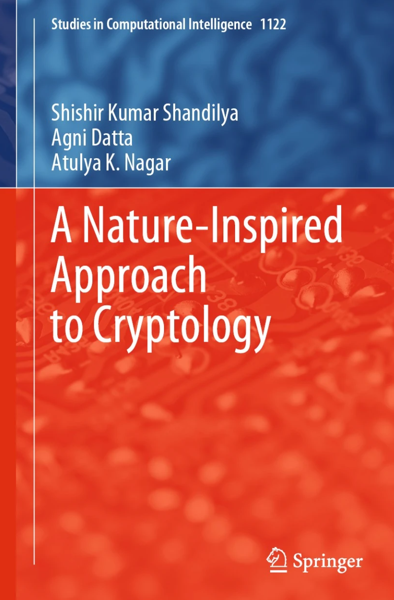

# VOCS_NATURES_ZK_STARKS.md

This exploration of parallels between natural systems and cryptographic principles is fascinating, particularly when viewing [volatile organic compounds (VOCs)](/literary_products/joes_notes/VOLATILE_ORGANIC_COMPOUNDS.md) and [chromatin remodeling](/literary_products/joes_notes/CHROMATIN_REMODELING.md) as biological analogs of [zk-STARKs](/literary_products/joes_notes/ZK_STARKS.md). For a deeper understanding of the biological underpinnings of such mechanisms, consider exploring the book *"Cryptographic Nature: Biology Meets Cryptography"* ([Springer](https://link.springer.com/book/10.1007/978-981-99-7081-0)). Here's a breakdown:

---

### **VOCs as Zero-Knowledge Signals**
- **Key Concept**: Plants use [volatile organic compounds (VOCs)](/literary_products/joes_notes/VOLATILE_ORGANIC_COMPOUNDS.md) to communicate stress states without disclosing specific details. This mirrors the zero-knowledge aspect of [zk-STARKs](/literary_products/joes_notes/ZK_STARKS.md), where proof of knowledge is verified without revealing the knowledge itself.
- **Analogous Features**:
  - **Encoding and Verification**: The VOC blend encodes stress information, which is "verified" by neighboring plants that react appropriately.
  - **Selective Disclosure**: Like [zk-STARKs](/literary_products/joes_notes/ZK_STARKS.md), the VOC system shares enough to signal a state (e.g., herbivore attack) without revealing specific attackers or internal processes.
- **Implications**: This demonstrates the efficiency and scalability of nature's cryptographic signaling, akin to [zk-STARKs enabling secure computation](https://en.wikipedia.org/wiki/ZK-STARKs) across decentralized systems.

**Figure**: Cover of *A Nature-Inspired Approach to Cryptology* by Shishir Kumar Shandilya, Agni Datta, and Atulya K. Nagar, part of the *Studies in Computational Intelligence* series (Springer, 2023). This book explores nature-inspired principles in cryptography, bridging biological systems and computational models. For more details, visit [Springer](https://link.springer.com/book/10.1007/978-981-99-7081-0).

---

### **Plant-Insect Interactions and zk-STARKs**
- **Parallel Mechanisms**:
  1. **[Induced Resistance](/literary_products/joes_notes/INDUCED_RESISTANCE.md)**: Dynamic plant responses to herbivory parallel [zk-STARKs](/literary_products/joes_notes/ZK_STARKS.md) generating proofs tailored to specific computational inputs.
  2. **Volatile Signaling**: Airborne [volatile organic compounds (VOCs)](/literary_products/joes_notes/VOLATILE_ORGANIC_COMPOUNDS.md) resemble the dissemination of cryptographic proofs, maintaining privacy while broadcasting actionable information.
  3. **Systemic Acquired Resistance (SAR)**: Signals trigger widespread defensive responses, akin to the scalability of [zk-STARKs](/literary_products/joes_notes/ZK_STARKS.md) across systems without compromising security.
- **Evolutionary Implication**: The interplay between plants and insects has refined these "cryptographic" systems, highlighting nature's optimization of secure, adaptive signaling.

---

### **Chromatin Remodeling as Proof Generation**
- **Biological Proof System**: [Chromatin remodeling](/literary_products/joes_notes/CHROMATIN_REMODELING.md) demonstrates a selective process for accessing genetic information, analogous to cryptographic proofs.
- **Steps in the Proof Process**:
  1. **Initial Binding**: The chromatin remodeling complex initiates DNA access without full exposure, akin to the setup phase of [zk-STARKs](/literary_products/joes_notes/ZK_STARKS.md).
  2. **ATP-Driven Verification**: The energy-driven process "proves" readiness for selective gene expression, comparable to proof verification in [zk-STARKs](https://en.wikipedia.org/wiki/ZK-STARKs).
- **Dynamic Adaptability**: Environmental cues influence chromatin states, reflecting the adaptive nature of cryptographic protocols that adjust to computational requirements and security needs.

---

### **Broader Implications**
- **Scalability**: Nature demonstrates efficient information exchange across complex systems, analogous to [zk-STARKs'](https://en.wikipedia.org/wiki/ZK-STARKs) ability to scale decentralized computations.
- **Privacy and Security**: Both natural and cryptographic systems prioritize selective information sharing, ensuring security while enabling action.
- **Cross-Disciplinary Insight**: These analogies underscore the potential for bio-inspired cryptographic models and further exploration of biological systems for technological innovation.

---

Nature's systems, whether in [plant signaling](/literary_products/joes_notes/PLANT_SIGNALING.md) or genetic regulation, embody principles central to cryptography, offering profound insights into secure and scalable information processing. This intersection highlights the potential for bio-inspired advancements in decentralized technology.
