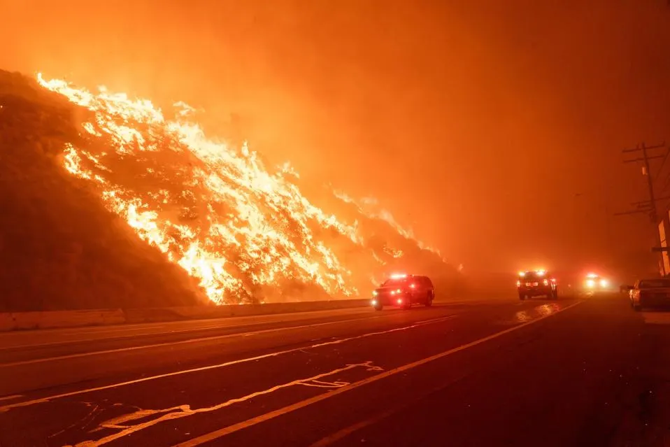

# PathDependence-Physics-CreativeDestruction

> This proposal positions "The Path Dependence and Physics of Creative Destruction" as a timely contribution to discussions on resilience, financial innovation, and socio-economic transformation in response to crises like natural disasters. It invites publishers to engage with an urgent topic at the intersection of economics, technology, and sustainability. I look forward to discussing this project further with interested publishers or agents.

**Header**

* **Title:** The Path Dependence and Physics of Creative Destruction
* **Author:** Joe Maristela
* **Email:** jmaristela2023@gmail.com
* **Phone Number:** 650-918-6796

### Brief Synopsis

"The Path Dependence and Physics of Creative Destruction" explores the intersection of natural disasters, unexplained phenomena, and the economic theory of [creative destruction](../joes_notes/misc/creative_destruction.md). This book examines how such events catalyze chain reactions that disrupt entrenched systems, leading to innovation and transformation across industries. By integrating insights from [economics](../joes_notes/misc/measurable_outcomes.md), [systems science](../joes_notes/misc/systems_science.md), and [physics](../joes_notes/physics/physics.md), it offers a groundbreaking perspective on how societies can leverage adversity to foster resilience, drive financial innovation, and embrace new paradigms.

The book highlights contemporary issues like the [Los Angeles wildfires of January 2025](../joes_notes/misc/los_angeles_wildfires_2025.md), which not only devastated communities but also deepened California's ongoing [insurance crisis](broken-reference). This crisis presents an opportunity for decentralized finance ([DeFi](../joes_notes/crypto/defi.md)) and blockchain technologies to disrupt traditional insurance models, offering innovative alternatives to classical finance.

### Longer Synopsis

Natural disasters often bring immediate destruction and hardship, but they also serve as catalysts for [creative destruction](../joes_notes/misc/creative_destruction.md)—a process central to capitalism as described by [Joseph Schumpeter](broken-reference). In this book, I argue that such crises force societies to reimagine outdated systems and embrace innovation. By analyzing historical examples alongside current events like the [Los Angeles wildfires of January 2025](../joes_notes/misc/los_angeles_wildfires_2025.md), I explore how these disruptions create opportunities for renewal in urban planning, disaster preparedness, and financial systems.

The [Los Angeles fires](../joes_notes/misc/los_angeles_wildfires_2025.md) exemplify this dynamic. With over 2,000 structures destroyed in affluent areas like Pacific Palisades and billions in insured losses, the fires have exacerbated California's "[insurance crisis](broken-reference)." Major insurers like State Farm have already withdrawn from high-risk markets, leaving homeowners reliant on limited last-resort options like the California FAIR Plan. This precarious situation underscores the need for innovative solutions.

Enter decentralized finance (DeFi) and blockchain technology. These emerging tools offer radical alternatives to traditional insurance by enabling peer-to-peer risk sharing, reducing administrative costs through smart contracts, and increasing transparency via immutable records. The book explores how blockchain-based insurance models could address gaps left by conventional insurers while fostering inclusivity and efficiency in risk management.

Key themes include:

* **Path Dependence:** How historical decisions shape disaster responses and influence recovery trajectories.
* **Systems Science:** Applying principles from physics to analyze the cascading effects of disruption in socio-economic systems.
* **Financial Innovation:** Exploring how DeFi and blockchain can revolutionize insurance markets in response to crises like the LA fires.

Through case studies ranging from earthquakes to pandemics to wildfires, this book provides a comprehensive framework for understanding how disasters can simultaneously dismantle old systems and pave the way for transformative change.

### Chapter Breakdown

1. **Introduction to Creative Destruction**
   * Overview of Schumpeter's theory and its relevance today.
2. **The Science of Disruption**
   * An exploration of how natural phenomena disrupt existing systems.
3. **Path Dependence Explained**
   * Analysis of historical contexts that shape responses to disasters.
4. **Case Study: The 1995 Kobe Earthquake**
   * Examination of recovery efforts and technological advancements post-disaster.
5. **Case Study: The January 2025 Los Angeles Fires**
   * Analysis of the fires' impact on communities and industries, with a focus on the insurance crisis and opportunities for DeFi/blockchain innovation.
6. **Public Spending as a Catalyst**
   * How government responses can facilitate creative destruction.
7. **Innovation in Crisis: The COVID-19 Pandemic**
   * Analyzing how the pandemic spurred technological adoption and changes in business models.
8. **Blockchain Insurance: A New Paradigm**
   * Exploring blockchain-enabled solutions for decentralized risk sharing, fraud prevention, and operational efficiency in insurance markets.
9. **Building Resilience: Lessons Learned**
   * Strategies for leveraging creative destruction to enhance future resilience.
10. **Conclusion: Embracing Change**
    * Reflections on adaptability as a cornerstone of progress.

### Audience

This book targets a diverse audience, including:

* Scholars and students in economics, disaster management, systems science, and financial technology.
* Policymakers seeking insights into effective disaster response strategies.
* Innovators in fintech exploring applications of blockchain in traditional industries.
* General readers interested in understanding how crises shape socio-economic transformation.

***

### Comparable & Competing Publications

1. **"The Resilience Dividend" by Judith Rodin (2014)**
   * Strengths: Comprehensive analysis of resilience strategies.
   * Weaknesses: Lacks a focus on the interplay between disasters and creative destruction or financial innovation.
2. **"Creative Destruction: How Globalization Is Changing the World's Cultures" by Tyler Cowen (2002)**
   * Strengths: Insightful discussion on globalization's impact.
   * Weaknesses: Limited exploration of natural disasters as agents of change or technological disruption.
3. **"Disaster Capitalism" by Naomi Klein (2016)**
   * Strengths: Critique of exploitation during crises.
   * Weaknesses: Focuses more on negative aspects without highlighting potential positive outcomes like innovation or financial reform.

### Status of the Work

I have completed a detailed outline and drafted several chapters. I anticipate having a complete manuscript ready by \[insert expected completion date].

### Peer Review Suggestions

| Name                  | Title                  | Affiliation                  | Expertise                                                                                                                       | Email                                 |
| --------------------- | ---------------------- | ---------------------------- | ------------------------------------------------------------------------------------------------------------------------------- | ------------------------------------- |
| Ufuk Akcigit          | Economist              | University of Chicago        | Co-editor of "The Economics of Creative Destruction," focusing on innovation and economic growth.                               | \[Contact through university website] |
| John Van Reenen       | Professor of Economics | London School of Economics   | Co-editor of "The Economics of Creative Destruction," with research interests in innovation, productivity, and economic policy. | \[Contact through university website] |
| Vladimir M. Cvetković | Professor              | \[Institution not specified] | Editor-in-Chief of the International Journal of Disaster Risk Management, focusing on disaster studies and policy.              | \[Contact through journal website]    |
