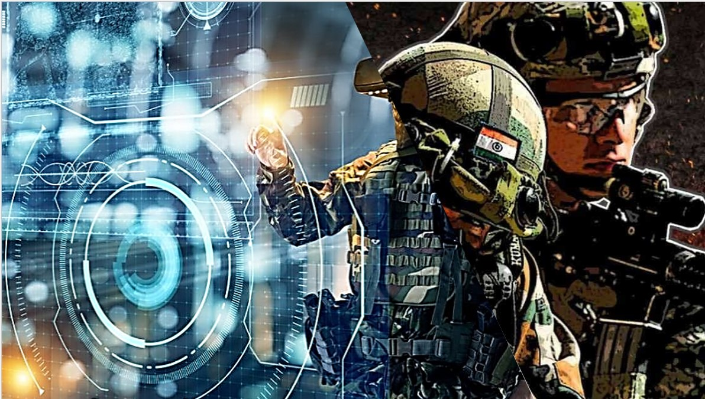

AI has a complex and multifaceted relationship with the idea that "war is inevitable," touching on its potential to **exacerbate, prevent, or fundamentally transform the nature of conflict.** Here are some key considerations:

### **1. AI as a Force Multiplier in Conflict**
#### **A. Accelerating Arms Races**
- **[Autonomous Weapons Systems (AWS)](/literary_products/joes_notes/AUTONOMOUS_WEAPONS_SYSTEMS.md):** AI is driving the development of increasingly autonomous weapons, from drones to unmanned submarines, creating new challenges for arms control and conflict escalation.
  - **Examples:** Lethal autonomous weapon systems (LAWS) like loitering munitions can operate without human oversight, reducing decision-making timeframes and increasing the potential for unintended escalation.
  - **Impact:** As states race to achieve AI superiority, the security dilemma intensifies, mirroring historical arms races but at a faster pace.

#### **B. Cyber Warfare**
- AI enables sophisticated **[cyberattacks](/literary_products/joes_notes/CYBER_WARFARE.md)** and defenses, capable of targeting critical infrastructure, financial systems, and communications networks.
  - **Examples:** AI-driven malware or deepfake propaganda can destabilize societies without direct kinetic conflict.
  - **Result:** Cyber capabilities blur the lines between peace and war, making conflict more pervasive and less predictable.

#### **C. Information Warfare and Disinformation**
- AI excels at generating and spreading disinformation through deepfakes, bots, and algorithmic amplification.
  - **Implication:** This undermines trust in institutions and destabilizes democracies, creating conditions ripe for conflict.

---

### **2. AI as a Tool for Preventing Conflict**
#### **A. Enhanced Predictive Capabilities**
- **[Conflict Forecasting](/literary_products/joes_notes/CONFLICT_FORECASTING.md):** AI can analyze vast datasets to identify early warning signs of conflict, such as economic instability, troop movements, or political unrest.
  - **Example:** AI-powered platforms like Horizon Scanning Systems are already used to monitor geopolitical risks.
  - **Potential Impact:** Early interventions could prevent wars before they escalate.

#### **B. Improved Decision-Making**
- AI can simulate and evaluate millions of scenarios to help leaders understand the consequences of various actions.
  - **Example:** Game theory models enhanced by AI could identify optimal diplomatic strategies to de-escalate tensions.
  - **Challenge:** Leaders must trust and act on these insights, which may not align with traditional political or military instincts.

#### **C. Non-Lethal Applications**
- **[Peacekeeping Operations](/literary_products/joes_notes/PEACEKEEPING_OPERATIONS.md):** AI can improve logistics, surveillance, and communication for peacekeeping missions, reducing human error and improving effectiveness.
- **Conflict Resolution Platforms:** AI-driven natural language processing (NLP) tools can facilitate negotiations by analyzing language patterns to identify common ground.

---

### **3. AI and the Transformation of War Itself**
#### **A. Shift Toward Asymmetric Warfare**
- AI levels the playing field, allowing smaller states or non-state actors to wield disproportionate power through tools like drones, cyberattacks, or propaganda campaigns.
  - **Example:** Non-state actors using AI-driven drones to conduct precision attacks on infrastructure.
  - **Result:** Traditional military hierarchies and power dynamics are disrupted.

#### **B. Deterrence and Escalation Risks**
- The integration of AI into nuclear command-and-control systems raises questions about decision-making in crises.
  - **[Automated Escalation](/literary_products/joes_notes/AUTOMATED_ESCALATION.md):** AI systems designed for rapid response may misinterpret data or escalate conflicts unintentionally.
  - **Challenge:** Balancing AI speed and accuracy with human oversight is critical to avoiding catastrophic outcomes.

#### **C. The Ethical Dilemma of Autonomous Weapons**
- **Responsibility:** If an AI-driven system causes harm, who is accountable? This creates ambiguity that undermines norms and laws governing conflict.
- **Proliferation:** Cheap, scalable AI systems may lead to widespread proliferation of lethal technologies.

---

### **4. Philosophical and Ethical Dimensions**
#### **A. Reframing Human Nature**
- If war is ingrained in human nature, could AI help us transcend these impulses by managing resources, fostering cooperation, and reducing inequality?
  - **Optimistic View:** AI could create systems of abundance and mitigate the scarcity that often drives conflict.
  - **Pessimistic View:** AI might amplify existing inequalities, leading to new sources of conflict.

#### **B. Dehumanizing Conflict**
- AI could make war more impersonal, reducing the human cost for aggressors and lowering the psychological barrier to initiating conflict.
  - **Implication:** When decision-makers are detached from the human toll, war may become more frequent and morally ambiguous.

#### **C. The Control Problem**
- AI systems in warfare might eventually operate beyond human control, leading to scenarios of unintended escalation or catastrophic mistakes.
  - **Examples in Fiction:** Narratives like *Skynet* in *Terminator* explore worst-case scenarios of AI turning against humanity.
  - **Real-World Concerns:** Experts like Elon Musk and Nick Bostrom have warned about the dangers of poorly controlled AI in military contexts.

---

### **5. AI and the Future of "War is Inevitable"**
#### **A. Challenging Deterministic Views**
- AI offers tools to identify and address the root causes of war, from resource scarcity to miscommunication, suggesting that war may not be as inevitable as it seems.
  - **Example:** AI-driven global collaboration platforms could foster understanding and cooperation across cultures.

#### **B. Creating New Determinisms**
- However, the widespread adoption of AI in military and civilian domains introduces new systemic risks, potentially locking humanity into cycles of AI-driven conflict.
  - **Risk:** The "AI Trap," where nations rely so heavily on AI for security that disarmament becomes impossible.

---

### **Conclusion**
AI is a double-edged sword in the discourse on the inevitability of war. While it offers unprecedented opportunities to predict, prevent, and manage conflicts, it also amplifies risks and introduces new challenges. Whether AI will ultimately exacerbate or mitigate the inevitability of war depends on how humanity chooses to develop, regulate, and integrate these technologies. In this sense, AI forces us to confront deeper questions about human nature, ethics, and the structures of power that shape our world.
