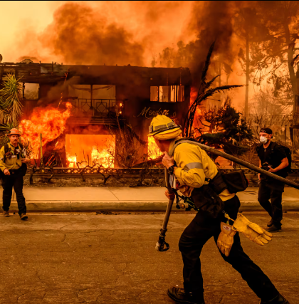

# Los Angeles Wildfires of January 2025

The **Los Angeles wildfires of January 2025** have been described as the most destructive in the city's history, with damages and economic losses estimated between $52 billion and $57 billion. These fast-moving fires, fueled by extreme winds, relentless drought, and climate change, have razed neighborhoods, forced mass evacuations, and left a trail of devastation across Southern California. The fires have also exposed critical vulnerabilities in urban planning, disaster preparedness, and the financial systems underpinning property insurance.

---

## Key Facts and Figures

- **Economic Impact:** Estimated damages range from $52 billion to $57 billion, making this one of the costliest wildfire events in California's history ([AccuWeather Inc.](https://www.euronews.com/business/2025/01/09/california-wildfires-cause-50-billion-in-damage-and-economic-losses)).
- **Human Impact:** At least five fatalities have been reported, with officials expecting the death toll to rise. Over 130,000 people remain under evacuation orders.
- **Property Damage:** More than 1,000 structures, including homes and businesses, have been destroyed. In Pacific Palisades alone, over 10,000 households and 13,000 structures are at risk ([Kristin M. Crowley](https://www.nytimes.com/2025/01/08/us/wildfires-los-angeles-california.html)).
- **Geographic Scope:** Major fires include the Palisades fire (scorching over 2,000 acres) and the Eaton fire in the San Gabriel Mountains (consuming 400 acres within hours).
- **Environmental Conditions:** The fires were fueled by wind gusts exceeding 100 mph—Southern California's strongest in over a decade—and critically dry vegetation due to prolonged drought ([National Weather Service](https://www.bworldonline.com/world/2025/01/09/645652/winds-warmth-and-relentless-drought-fueled-los-angeles-fires-scientists-say)).

---

## Causes of the Wildfires

1. **Climate Change**  
   Scientists attribute these fires to climate change-induced weather extremes. California's average temperature has increased by approximately 1°C since 1980, doubling the number of days with dry vegetation vulnerable to fire ([European Forest Institute](https://www.bworldonline.com/world/2025/01/09/645652/winds-warmth-and-relentless-drought-fueled-los-angeles-fires-scientists-say)).

2. **Unusual Wind Patterns**  
   The fires were exacerbated by a rare atmospheric phenomenon known as a "mountain wave," which amplified wind speeds as air descended from mountain ranges. This event created conditions similar to those seen during Colorado's Marshall Fire in December 2021 ([National Weather Service](https://www.bworldonline.com/world/2025/01/09/645652/winds-warmth-and-relentless-drought-fueled-los-angeles-fires-scientists-say)).

3. **Urban Vulnerabilities**  
   Los Angeles' densely populated urban landscape includes flammable materials such as wooden homes (built to earthquake codes), hanging power lines, and propane tanks. These factors contributed to the rapid spread of flames ([Lindon Pronto](https://www.bworldonline.com/world/2025/01/09/645652/winds-warmth-and-relentless-drought-fueled-los-angeles-fires-scientists-say)).

---

## Insurance Crisis

The wildfires have intensified California's ongoing [insurance crisis](/literary_products/joes_notes/INSURANCE_CRISIS.md). Many residents in high-risk areas like Pacific Palisades report being unable to secure property insurance as major insurers withdraw from these markets due to unsustainable losses.

### Implications for Traditional Insurance
- **Market Retreat:** Companies like State Farm have ceased offering coverage in wildfire-prone regions.
- **Limited Options:** Homeowners are increasingly reliant on last-resort programs like the California FAIR Plan.
- **Economic Inequality:** Wealthier residents may afford self-insurance or alternative options, while middle- and lower-income homeowners face significant financial risks.

### Opportunities for Decentralized Finance (DeFi)
The insurance gap created by these wildfires presents an opportunity for [DeFi](/literary_products/joes_notes/DEFI.md) and blockchain-based solutions:
1. **Peer-to-Peer Risk Sharing:** Platforms like Nexus Mutual enable communities to pool resources for decentralized insurance.
2. **Smart Contracts:** Automated claims processing ensures faster payouts based on verified disaster data ([smart contracts](/literary_products/joes_notes/SMART_CONTRACTS.md)).
3. **Transparency:** Blockchain's immutable ledger reduces fraud and enhances trust.
4. **Inclusivity:** DeFi models can provide coverage to underserved communities excluded by traditional insurers.

---

## Environmental and Urban Impacts

1. **Health Risks:** Smoke inhalation poses long-term health challenges for affected populations.
2. **Tourism Decline:** The destruction of iconic areas like Malibu threatens Southern California's tourism industry.
3. **Urban Planning Challenges:**
   - Vegetation loss increases the risk of rockslides on steep slopes.
   - Rebuilding efforts must account for both fire resistance and earthquake safety.

---

## Lessons Learned

The Los Angeles wildfires highlight systemic vulnerabilities that require urgent attention:
- **Climate Adaptation:** Policymakers must prioritize climate-resilient infrastructure and proactive fire management strategies.
- **Financial Innovation:** The crisis underscores the need for alternative insurance models that leverage technology to fill coverage gaps.
- **Community Resilience:** Recovery efforts should focus on rebuilding not just structures but also social networks and local economies.

---

## Conclusion

The Los Angeles wildfires of January 2025 serve as a stark reminder of the growing risks posed by climate change and urban vulnerabilities. While the immediate focus remains on containment and recovery, this disaster also presents an opportunity for innovation in urban planning, financial systems, and disaster preparedness.

By embracing technologies like [DeFi](/literary_products/joes_notes/DEFI.md) and [smart contracts](/literary_products/joes_notes/SMART_CONTRACTS.md), communities can build more resilient systems capable of withstanding future crises. As California grapples with this unprecedented challenge, it has the potential to set a global example for adaptive recovery in the face of climate-driven disasters.
