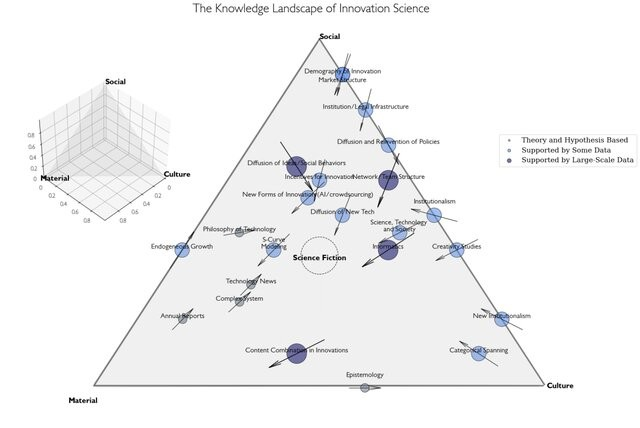

# Physics

Physics is more than just a natural science—it is a lens through which we can understand complex systems undergoing transformation. From its role in driving technological innovation to its applications in modeling economic systems like DeFi or wildfire insurance crises, physics continues to shape our understanding of creative destruction on both micro and macro scales.

By integrating physics with economics, biology, and technology, we unlock new possibilities for addressing global challenges while advancing our understanding of change itself.

## Definition and Scope

**Physics** is the branch of science concerned with the nature and properties of matter, energy, space, and time. It seeks to understand the fundamental principles governing the universe, from the smallest subatomic particles to the largest cosmic structures. Physics serves as a foundation for numerous scientific disciplines, including chemistry, biology, and engineering, and it has profound implications for technology, economics, and even societal evolution.

The discipline is divided into several subfields:

* **Classical Mechanics:** The study of motion and forces.
* **Thermodynamics:** The study of heat, energy, and work.
* **Quantum Mechanics:** The study of behavior at atomic and subatomic scales.
* **Relativity:** The study of space-time and gravitation.
* **Statistical Physics:** The study of systems with many interacting components, bridging physics with complex systems like economies.

> Figure - "Destructive Creation, Creative Destruction, and the Paradox of Innovation Science." ResearchGate, October 2023, <https://www.researchgate.net/publication/364453809\_Destructive\_Creation\_Creative\_Destruction\_and\_the\_Paradox\_of\_Innovation\_Science>. Accessed January 10, 2025.

## The Role of Physics in Creative Destruction

Physics plays a significant role in understanding and modeling processes of [creative destruction](../misc/creative_destruction.md), a concept originally coined by economist Joseph Schumpeter. The principles of physics—particularly those related to energy transformation, entropy, and systems dynamics—help explain how innovation disrupts existing structures to create new opportunities.

### Examples

1. **Thermodynamics of Innovation:**
   * In physics, entropy measures disorder in a system. Similarly, innovation often emerges from "disordered" or unstable conditions in economic or social systems. This mirrors the second law of thermodynamics: systems evolve toward states of higher entropy unless acted upon by external forces.
2. **Complex Systems Theory:**
   * Physics-based models like percolation theory or network dynamics are used to study how disruptions propagate through interconnected systems. These models help explain phenomena such as market crashes or technological shifts.
3. **Econophysics:**
   * A field that applies statistical physics to economic systems. For example, econophysicists use kinetic exchange models (inspired by particle interactions) to study wealth distribution or market behavior ([source](https://www.iop.org/sites/default/files/2019-04/role-of-physics-in-supporting-economic-growth.pdf)).

***

## Physics as a Driver of Economic Growth

Physics-based industries contribute significantly to global economies by driving innovation in technology, manufacturing, and energy. According to the Institute of Physics (IOP), physics-based businesses in the UK alone contribute £177 billion annually to gross value added (GVA), accounting for 10% of GDP ([source](https://www.iop.org/sites/default/files/2019-04/role-of-physics-in-supporting-economic-growth.pdf)).

### Applications

1. **Renewable Energy Technologies:**
   * Advances in solar panels (photovoltaics) and wind turbines rely on quantum mechanics and fluid dynamics.
2. **Semiconductors and Computing:**
   * The development of microchips is rooted in solid-state physics.
3. **Medical Technologies:**
   * Imaging techniques like MRI and PET scans are based on nuclear and particle physics.

***

## Physics in Decentralized Finance (DeFi)

Physics also informs innovations in [Decentralized Finance (DeFi)](../CRYPTO/DEFI.MD), particularly through concepts like entropy and system stability:

1. **Blockchain Dynamics:**
   * Blockchain networks can be modeled as complex systems that self-organize under constraints like computational power or energy consumption.
2. **Smart Contracts:**
   * The automation of financial agreements via [smart contracts](../technology/smart_contracts.md) reflects deterministic principles akin to those in classical mechanics.

***

## Case Study: Los Angeles Wildfires (2025)

The [Los Angeles wildfires of January 2025](../misc/los_angeles_wildfires_2025.md) provide a real-world example where physics intersects with socio-economic challenges:

1. **Fire Dynamics:**
   * Physics explains the behavior of wildfires through fluid dynamics (wind patterns) and thermodynamics (heat transfer).
2. **Insurance Crisis Modeling:**
   * Statistical physics can model risk distribution among insurers withdrawing from high-risk areas.
3. **DeFi Solutions:**
   * Blockchain-based insurance models leverage principles from statistical mechanics to create decentralized risk pools.

***

## Emerging Field: Creative Destruction in Biological Systems

Recent research has applied the concept of creative destruction to biological evolution ([source](https://phys.org/news/2023-03-creative-destruction-probing-evolution-proteins.html)). For example:

1. **Protein Evolution:**
   * Proteins evolve through processes akin to creative destruction, where older protein folds are dismantled or merged to create new functional structures.
2. **Cancer Research:**
   * Misfolded proteins involved in diseases like cancer reflect destructive creation cycles at cellular levels.

This interdisciplinary approach highlights how physics can provide insights into both natural and artificial systems undergoing transformation.

***

## Challenges and Criticisms

While physics provides powerful tools for understanding creative destruction and systemic change, it also faces limitations:

1. **Reductionism:**
   * Critics argue that reducing complex socio-economic phenomena to physical models oversimplifies human behavior.
2. **Data Requirements:**
   * Many physics-based models require extensive data, which may not always be available or reliable.
3. **Ethical Concerns:**
   * Applications like AI-driven econophysics raise questions about fairness and unintended consequences.
